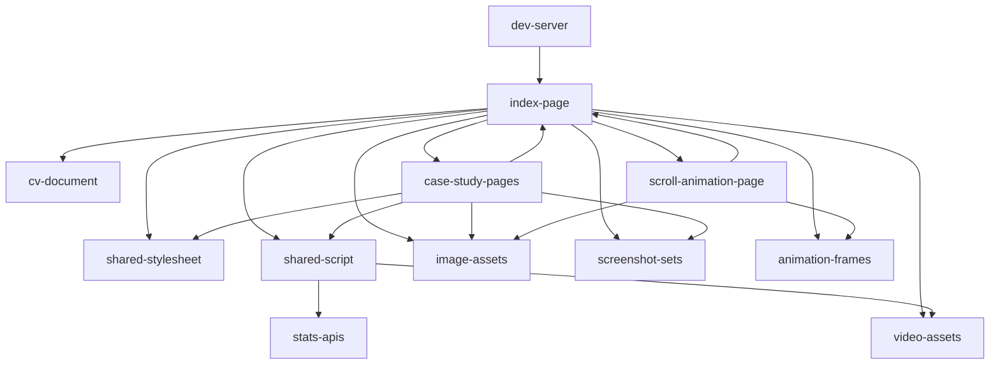

# AboutMe — architecture

## 1. Stack

- HTML5 — seven hand-written pages at the repo root. No templating, no build step.
- CSS3 — `css/style.css`: tokens in `:root`, Grid/Flexbox, `clamp()`. Light theme only.
- Vanilla ES6+ JS — `js/script.js`: IIFEs over `IntersectionObserver` + `fetch`. No bundler.
- Fonts — Fraunces (display), Hanken Grotesk (body/UI), JetBrains Mono (labels), via Google Fonts.
- Tailwind CDN — `wpdev.html` only (`cdn.tailwindcss.com`, L24). No other dependency anywhere.

## 2. Directory map

| path | what lives there |
|---|---|
| `index.html` | Single-page hub: hero, about, experience, skills, work, problem-solving, contact. |
| `ai-dev.html` | Case study — AI integration & development. |
| `pos.html` | Case study — pharmacy POS. Inline gallery engine over `parmacyShop/` + `images/pos/`. |
| `ecommerce.html` | Case study — MegaBazar. Same gallery engine over `MegaBazar/`. |
| `automation.html` | Case study — AIUB Notice Bot. Inline SVG architecture diagram. |
| `websites.html` | Case study — private business tools. Loads no JS. |
| `wpdev.html` | Case study — scroll-linked canvas. Standalone: Tailwind CDN + own inline CSS/JS. |
| `css/style.css` | The only stylesheet. Loaded by every page except `wpdev.html`. |
| `js/script.js` | The only script. Loaded by every page except `wpdev.html` and `websites.html`. |
| `images/` | Favicon, SVG logos, portraits, project previews. |
| `images/pos/` | POS screenshots by role — `admin/`, `manager/`, `cashier/` (23 files). |
| `Animation/` | 52-frame PNG sequence, `222_000.png … 222_051.png`. |
| `MegaBazar/` | 9 e-commerce screenshots, `NN-name.png`. |
| `parmacyShop/` | 13 pharmacy POS screenshots, `NN-name.png`. |
| `videos/` | Drop-point for `intro.mp4`. Currently holds only `README.md`. |
| `Siam-Hossain-CV.pdf` | CV. Linked only from `index.html`. |
| `.claude/` | `server.mjs` dev server + `launch.json`. `review-report.html` is an unwired one-off. |
| `README.md` | Human-facing project readme. |

## 3. Diagram

## 4. Component index

- [[index-page]]
- [[case-study-pages]]
- [[scroll-animation-page]]
- [[shared-stylesheet]]
- [[shared-script]]
- [[image-assets]]
- [[screenshot-sets]]
- [[animation-frames]]
- [[video-assets]]
- [[cv-document]]
- [[dev-server]]
- [[stats-apis]]

## 5. Entry points

- Dev — `node .claude/server.mjs` → `http://127.0.0.1:8765`. Serves the repo root; `/` maps to `/index.html` (`.claude/server.mjs`).
- Dev, no Node — `python3 -m http.server 8765` from the repo root.
- Prod — repo root served as static files by GitHub Pages; `index.html` is the document root.
- Every page's `<body>` entry is `main#top`; case-study pages link back to `index.html#work`.

## 6. Conventions

- Shared CSS lives in `css/style.css`; per-page overrides live in that page's own `<style>` block, which is loaded after the stylesheet link (`index.html` L28 then L37–168).
- Every page carries an inline `<style>`; only `wpdev.html` carries no shared asset at all.
- Case-study pages are named for the project, at the repo root, one file each.
- Screenshot sets are top-level directories of `NN-name.png` files; the `NN` prefix is the display order.
- `Animation/` uses a fixed-width frame sequence (`222_NNN.png`) read by index, not by name lookup.
- JS is wrapped in IIFEs that early-return when their target elements are absent, so one script serves every page.
- Network failures are swallowed (`catch {}`) so the hardcoded values already in the HTML remain the visible fallback (`js/script.js`).

## 7. Where things go

- **Add a case-study page** — copy `websites.html` (smallest, 202 lines); update `<title>` + meta (L6–22), keep the `css/style.css` link and the `index.html#work` top-bar links; then add a card in `index.html` `.work-grid` (L455).
- **Add a project card to the hub** — one `<a class="work-card">` inside `index.html` `.work-grid` (L455). Use `.wc-thumb-code` instead of `.wc-thumb` when there is no image.
- **Add a screenshot set to a gallery** — drop `NN-name.png` files into a new top-level directory, then append one `{id, name, folder, screens, pitch, meta}` object to `const projects` in `pos.html:189` or `ecommerce.html:188`. `folder` is the directory name; each `screens` entry is `[stem, label]` resolved as `<folder>/<stem>.png`.
- **Add a live-stat card** — markup in `index.html` `.ps-cards` (L557) with a new `data-platform`; a colour rule beside `css/style.css` L335–338; a fetch function calling `setLive()` inside the `platformStats` IIFE in `js/script.js`, added to its `Promise.allSettled` list.
- **Restyle one page only** — put it in that page's own `<style>` block, never in `css/style.css`, which six pages share.
